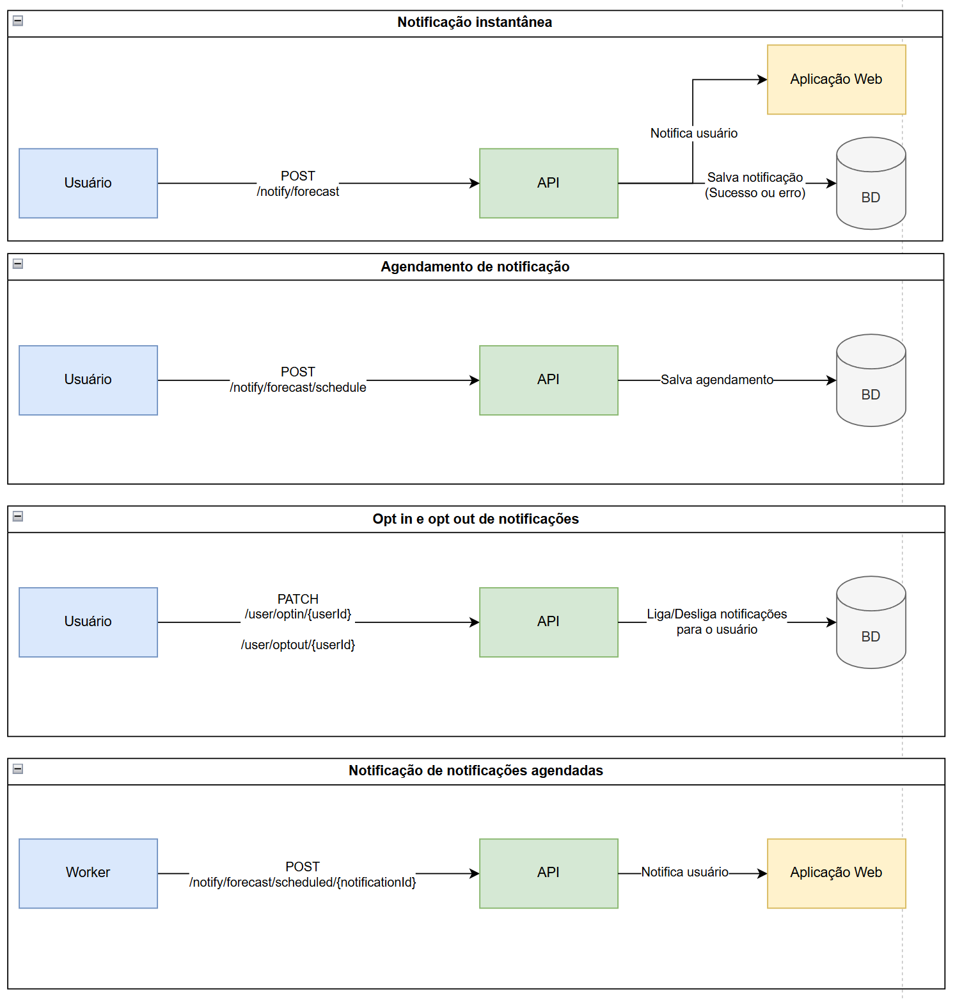

# Meli Desafio Backend IT ARC

## Visão Geral

Este projeto é orquestrado usando Docker Compose. Ele possui quatro subprojetos: um banco de dados Postgres, uma API Java Spring, um Worker Java Spring e uma aplicação mock em GO.

## Serviços

### PostgreSQL
- **Imagem**: `postgres:15`
- **Descrição**: Este serviço executa um banco de dados PostgreSQL para armazenar dados de notificações e usuários.

### API
- **Build**: `./desafio-backend-it-arc-api`
- **Descrição**: Este serviço executa a API principal do projeto, que interage com o banco de dados PostgreSQL e a API externa CPTEC.

### Worker
- **Build**: `./desafio-backend-it-arc-worker`
- **Descrição**: Este serviço executa um scheduler que consulta o banco de dados para verificar se há notificações pendentes que devem ser enviadas, chamando a API via HTTP quando necessário.

### Mock
- **Build**: `./desafio-backend-it-arc-mock`
- **Descrição**: Este serviço executa uma aplicação mínima em GO que retorna OK quando recebe um POST, sua funcionalidade é somente mocar uma resposta no fluxo.

## Executando o Projeto

1. **Clone o repositório**:
    ```sh
    git clone https://github.com/Lucaslsps/meli-desafio-backend-it-arc.git
    cd meli-desafio-backend-it-arc
    ```

2. **Inicie os serviços**:
    ```sh
    docker-compose up -d
    ```

3. **Verifique o status dos serviços**:
    ```sh
    docker-compose ps
    ```

## Inicialização do Banco de Dados

O banco de dados PostgreSQL é inicializado com os seguintes scripts localizados no diretório `./db`:

- `01-create-tables.sql`: Cria as tabelas `notifications` e `users`.
- `02-insert-data.sql`: Insere dados de seed nas tabelas `notifications` e `users`.

Para conectar localmente ao banco basta usar:
- String de conexão: jdbc:postgresql://localhost:5432/postgres
- Usuário: admin
- Senha: secret

## Health Checks

O serviço `postgres` inclui uma verificação de saúde para garantir que o banco de dados esteja pronto antes que outros serviços iniciem.

A nível de aplicação, a API principal possui um endpoint de health check para verificação de sua saúde acessável via: http://localhost:8080/actuator/health

## Documentação

O ecosistema funciona de modo que é possível fazer notificações a nível de cidades. Sejam essas notificações agendadas ou não.

Para notificações diretas, há uma rota na API principal que cuida de, além de notificar o usuário (através do projeto mock, simulando um projeto Web do desafio), também salvar essa notificação com seu status no banco.

Para notificações agendadas, é necessário que primeiro haja uma requisição na API principal, agendando essa notificação. Após esse registro, o worker ficará lendo a tabela de notificações até chegar a hora dessa notificação ser enviada.

O processo de envio de notificação agendada é similar ao de notificação direta, porém o worker fica encarregado de salvar o status da notificação no banco, em caso de sucesso ou falha.


### API

A API possui uma documentação de endpoints via swagger acessível por: http://localhost:8080/swagger-ui/index.html

### Fluxos



## Segurança

A aplicação principal possui autenticação via token JWT, sua secret é definida pela variável de ambiente security.secret.

Seu valor padrão é "secret". Um token novo pode ser gerado via https://jwt.io/ ou pode ser usado o token já contido na collection Postman na raiz desse projeto

## Testes

As aplicações principais possuem cobertura maior do que 90%, possuindo testes integrados para seus fluxos.

## Conclusão

Este projeto demonstra uma arquitetura de múltiplos serviços usando Docker Compose, com foco em interações com banco de dados, processamento em segundo plano e integração com API externa.